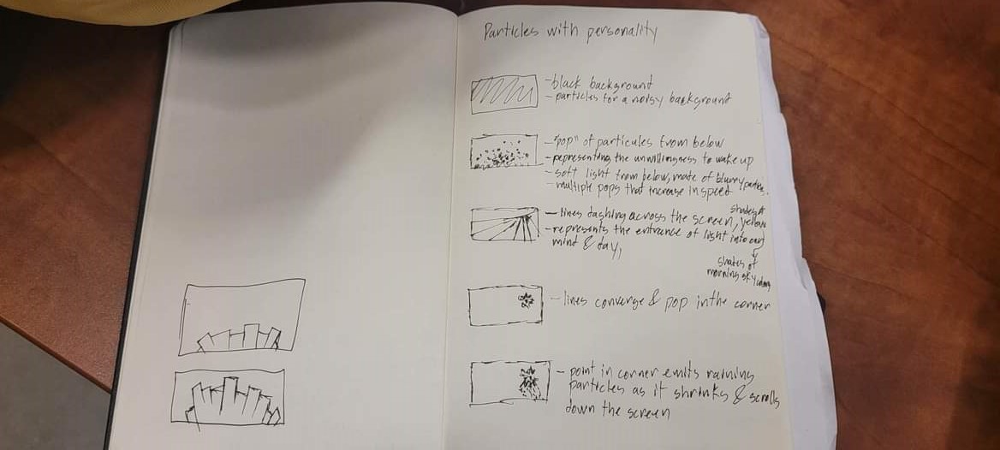

# Particle systems project

## Prompt: Forced to wake up early

>I wanted to utilize a variety of concepts we learned about to make a relatively simple piece that could convey the idea at hand.
>
>I drew from my own past experiences of being woken up suddenly to portray this, remembering the confusion and especially the lack of ability to process visual information when woken up suddenly. I used the noise function in the second phase of the project to blur the arcs on screen.
>
>
>Here's a photo of my initial brainstorm, hopefully I can do projects with more events in them in the future. 
>
>
>As discussed in class, I could have made better use of classes by merging my two classes into one, given their similarities, using methods only to make them change as they do in the final product.
>
>Although I will say that I am proud that I was able to use a 2 of the new functions introduced for this project in meaningful ways, such as dist() and noise(), along with being able to tie in the use of the sound library once again. 
> 
>Using function(){self.return() within setInterval() in combination with self = this to indicate to the setInterval() function that it needed to run return() every second, modifying the parameters tied to that method identified with the self variable was difficult.
>
>But understanding that i multiplied by angleoffset and passing it through the constructor with a variable named angle, to get different every instance to have a different rotation angle was an even more difficult task.
>
>With some help from the C:lab, I got there and mostly understand these concepts. Although, passing a variable through functions in the brackets () is still an issue I struggle to understand overall. The more I use it, the better I understand it, so there's hope for me yet.
